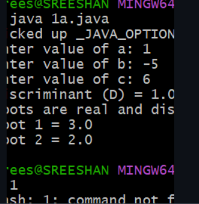
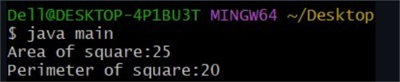
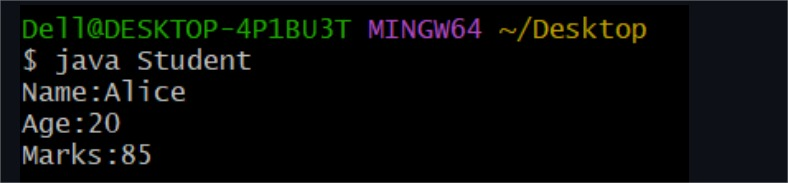
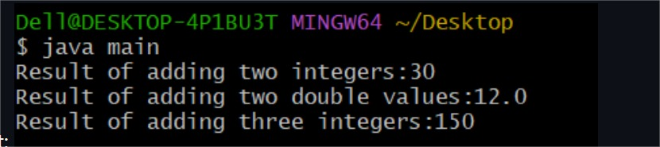
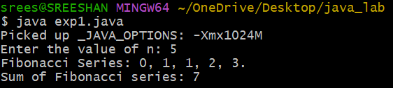
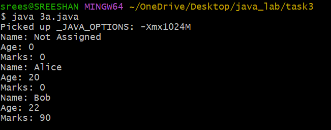
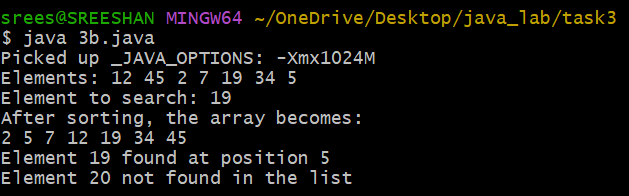

# Javalab-CSE-F
##title:Default values
```java 

class DefaultValues {
    byte b;
    short s;
    int i;
    long l;
    float f;
    double d;
    char c;
    boolean bool;
}

public class DisplayDefaultValues {
    public static void main(String[] args) {

        DefaultValues obj = new DefaultValues();

        System.out.println("Default byte value: " + obj.b);
        System.out.println("Default short value: " + obj.s);
        System.out.println("Default int value: " + obj.i);
        System.out.println("Default long value: " + obj.l);
        System.out.println("Default float value: " + obj.f);
        System.out.println("Default double value: " + obj.d);
        System.out.println("Default char value: '" + obj.c + "'");
        System.out.println("Default boolean value: " + obj.bool);
    }
}


```


##output


## task 1b

##title:qudratic eqn
```java 
import java.util.Scanner;

class QuadraticRoots {
    public static void main(String[] args) {

        double a, b, c, D;
        Scanner sc = new Scanner(System.in);

        System.out.print("Enter value of a: ");
        a = sc.nextDouble();

        System.out.print("Enter value of b: ");
        b = sc.nextDouble();

        System.out.print("Enter value of c: ");
        c = sc.nextDouble();

        D = b * b - 4 * a * c;
        System.out.println("Discriminant (D) = " + D);

        if (D > 0) {
            double x1 = (-b + Math.sqrt(D)) / (2 * a);
            double x2 = (-b - Math.sqrt(D)) / (2 * a);

            System.out.println("Roots are real and distinct.");
            System.out.println("Root 1 = " + x1);
            System.out.println("Root 2 = " + x2);

        } else if (D == 0) {
            double x = -b / (2 * a);
            System.out.println("Roots are real and equal.");
            System.out.println("Root = " + x);

        } else {
            double real = -b / (2 * a);
            double imaginary = Math.sqrt(-D) / (2 * a);

            System.out.println("Roots are imaginary (complex).");
            System.out.println("Root 1 = " + real + " + i" + imaginary);
            System.out.println("Root 2 = " + real + " - i" + imaginary);
        }

        sc.close();
    }
}

```




## task 2a

##title:square
```java 
class square{
int length;
int areaofsquare(){
return length*length;
}
int perimeterofsqaure(){
retrun 4*length;
}
}
class main{
public static void main(String args[]){
square sq=new square();
sq.length=5;
int area=sq.areaofsquare();
int perimeter=perimeterofsquare();
System.out.println("Area of Square:"+area);
System.out.println("Perimeter of Square:"+perimeter);
}
}
```



## 2B
```java
class Add{
int add(int a,int b){
return a+b;
}
double add(double a,double b){
return a+b;
}
int add(int a,int b,int c){
return a+b+c;
}
}
class main{
public static void main(String args[]){
Add obj=new Add();
System.out.println("Result of adding two integers:"+obj.add(10,20));
System.out.println("Result of adding two double values:"+obj.add(5.5,6.5));
System.out.println("Result of adding three integers:"+obj.add(40,50,60));
}
}


```



## 2C


```java


class Student{
String name;
int age;
int marks;
Student(String n,int a,int b){
name=n;
age=a;
marks=m;
}
void display(){
System.out.println("Name:"+name);
System.out.println(Age:"+age);
System.out.println("Marks:"+marks);
}
public static void main(String args[]){
Student s1=new Student("Alice",20,85);
s1.display();
}
}


```


###output





##additioanal exp1

```java

import java.util.Scanner;

class Fibonacci {

    int n;
    int firstNumber;
    int secondNumber;
    int thirdNumber;
    int sum;

   
    Fibonacci(int number) {
        n = number;
        firstNumber = 0;
        secondNumber = 1;
        thirdNumber = 0;
        sum = 0;
    }

   
    void generate() {
        System.out.print("Fibonacci Series: ");

        int count = n;  

        while (n > 0) {
            sum += firstNumber;

            if (n == 1) {
                System.out.print(firstNumber + ".");
            } else {
                System.out.print(firstNumber + ", ");
            }

            thirdNumber = firstNumber + secondNumber;
            firstNumber = secondNumber;
            secondNumber = thirdNumber;

            n--;
        }

        System.out.println("\nSum of Fibonacci series: " + sum);
    }


    public static void main(String[] args) {
        Scanner sc = new Scanner(System.in);

        System.out.print("Enter the value of n: ");
        int number = sc.nextInt();

        Fibonacci f = new Fibonacci(number);
        f.generate();
    }
}

```

##output




## 3a


```java


class Student {

    String name;
    int age;
    int marks;

    // Default constructor
    Student() {
        name = "Not Assigned";
        age = 0;
        marks = 0;
    }

    // 2-parameter constructor
    Student(String n, int a) {
        name = n;
        age = a;
        marks = 0;
    }

    // 3-parameter constructor
    Student(String n, int a, int m) {
        name = n;
        age = a;
        marks = m;
    }

    // Display method
    void display() {
        System.out.println("Name: " + name);
        System.out.println("Age: " + age);
        System.out.println("Marks: " + marks);
    }

    // Main method
    public static void main(String[] args) {

        Student s1 = new Student();                 // default constructor
        Student s2 = new Student("Alice", 20);      // 2-parameter constructor
        Student s3 = new Student("Bob", 22, 90);    // 3-parameter constructor

        s1.display();
        s2.display();
        s3.display();
    }
}


```

##output




##3c

```java


import java.util.Arrays;

class BinarySearchDemo {

    public static void main(String[] args) {

        int[] arr = {12, 45, 2, 7, 19, 34, 5};
        int key1 = 19;
        int key2 = 20;

        System.out.print("Elements: ");
        for (int x : arr) {
            System.out.print(x + " ");
        }
        System.out.println();

        System.out.println("Element to search: " + key1);

   
        Arrays.sort(arr);

        System.out.println("After sorting, the array becomes:");
        for (int x : arr) {
            System.out.print(x + " ");
        }
        System.out.println();

     
        int pos1 = binarySearch(arr, key1);
        if (pos1 != -1) {
            System.out.println("Element " + key1 + " found at position " + pos1);
        } else {
            System.out.println("Element " + key1 + " not found in the list");
        }

        
        int pos2 = binarySearch(arr, key2);
        if (pos2 != -1) {
            System.out.println("Element " + key2 + " found at position " + pos2);
        } else {
            System.out.println("Element " + key2 + " not found in the list");
        }
    }

   
    static int binarySearch(int[] arr, int key) {
        int low = 0, high = arr.length - 1;

        while (low <= high) {
            int mid = (low + high) / 2;

            if (arr[mid] == key)
                return mid + 1; // 1-based indexing
            else if (arr[mid] < key)
                low = mid + 1;
            else
                high = mid - 1;
        }
        return -1;
    }
}


```


##output




##3c

```java


class BubbleSort {

    public static void main(String[] args) {

        int[] arr = {34, 12, 45, 7, 19};
        int n = arr.length;

        System.out.println("Number of elements: " + n);

        System.out.print("Elements: ");
        for (int i = 0; i < n; i++) {
            System.out.print(arr[i] + " ");
        }
        System.out.println();

        for (int i = 0; i < n - 1; i++) {
            for (int j = 0; j < n - 1 - i; j++) {
                if (arr[j] > arr[j + 1]) {
                    int temp = arr[j];
                    arr[j] = arr[j + 1];
                    arr[j + 1] = temp;
                }
            }
        }

        System.out.println("Expected Output (Sorted Array):");
        for (int i = 0; i < n; i++) {
            System.out.print(arr[i] + " ");
        }
    }
}

```

##output


