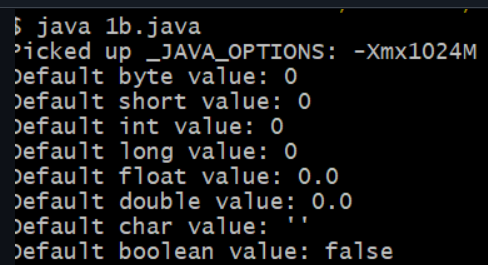

# Javalab-CSE-F
##title:Default values
```java 

class DefaultValues {
    byte b;
    short s;
    int i;
    long l;
    float f;
    double d;
    char c;
    boolean bool;
}

public class DisplayDefaultValues {
    public static void main(String[] args) {

        DefaultValues obj = new DefaultValues();

        System.out.println("Default byte value: " + obj.b);
        System.out.println("Default short value: " + obj.s);
        System.out.println("Default int value: " + obj.i);
        System.out.println("Default long value: " + obj.l);
        System.out.println("Default float value: " + obj.f);
        System.out.println("Default double value: " + obj.d);
        System.out.println("Default char value: '" + obj.c + "'");
        System.out.println("Default boolean value: " + obj.bool);
    }
}


```


##output





